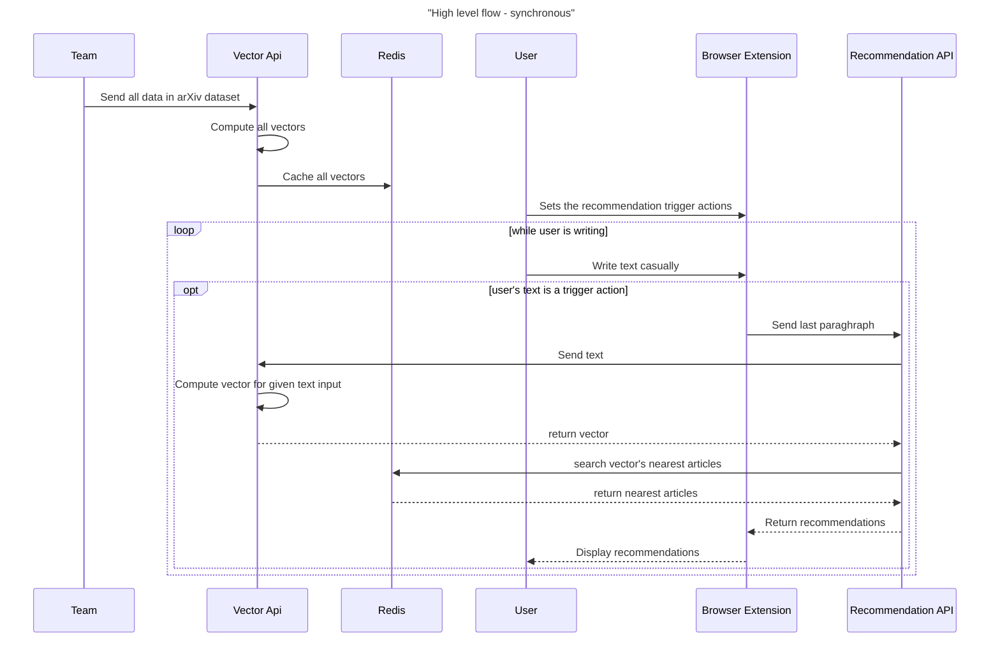

# redisventures-hackunamadata
https://hackathon.redisventures.com/

```mermaid
sequenceDiagram
    title "High level flow - synchronous"

    Team ->> Vector Api: Send all data in arXiv dataset
    Vector Api ->> Vector Api: Compute all vectors
    Vector Api ->> Redis: Cache all vectors

    User ->> Browser Extension: Sets the recommendation trigger actions

    loop while user is writing
        User ->> Browser Extension: Write text casually
        opt user's text is a trigger action
            Browser Extension ->> Recommendation API: Send last paraghraph
            Recommendation API ->> Vector Api: Send text
            Vector Api ->> Vector Api : Compute vector for given text input
            Vector Api -->> Recommendation API: return vector
            Recommendation API ->> Redis: search vector's nearest articles
            Redis -->> Recommendation API: return nearest articles
            Recommendation API -->> Browser Extension: Return recommendations
            Browser Extension -->> User: Display recommendations
        end
    end
```
