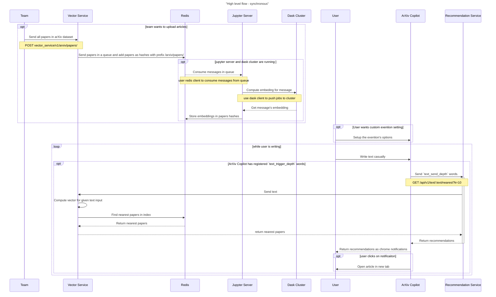

<div align="center">

</div>

# ArXiv Copilot </br> Redisventures - Hackunamadata team

## :bookmark_tabs: Menu

* [Overview](#overview)
* [How to install ArXiv Copilot](#how-to-install-arxiv-copilot)
* [Sequence Diagram](#sequence-diagram)
* [Developer Guide](#developer-guide)
  * [Redis - Data structure](#redis---data-structure)
  * [Vector Service](#vector-service)
  * [Recommendation Service](#recommendation-service)
  * [ArXiv Copilot](#arxiv-copilot)
* [License](#license)
* [Authors](#authors)

## Overview

ArXiv Copilot is a Chrome extension that is giving you live suggestions of scientific papers that could interest you when you're writing an article, course notes, ...
</br>It is a system created using the Vector Search technology on the [arXiv scholarly papers dataset](https://arxiv.org/).
This was developed during the [Vector Search Engineering Lab (Hackathon)](https:/hackathon.redisventures.com/), in collaboration with Saturn Cloud and Redis, by three data engineers and one data scientist from Artefact Paris.
</br>If you want to understand more how the tool was thought and made, you can read our article [here](https://docs.google.com/document/d/14p3btpmbXqG21guGo1Bf6Wf9mrt3gc6wc-CJ0aMpUWQ/edit?usp=sharing).

## How to install ArXiv Copilot

See [here](./browser_extension/README.md) to know how to install the browser extension and enjoy the use of ArXiv Copilot.

## Sequence Diagram


# Developer Guide
## Redis - Data structure
```json
{
    "id": "1801.00001",
    "title": "Title of the paper",
    "abstract": "Abstract of the paper",
    "categories": "cs.AI cs.CL cs.LG",
    "authors": "Author 1, Author 2, Author 3",
    "journal-ref": "Phys. Rev. B 76, 174425 (2007)"
}
```

## Vector Service
### Endpoints

| Endpoint | Method | Description | Request Body | Response Body |
| --- | --- | --- | --- | --- |
| /vector_service/v1/arxiv/papers | POST | Add the papers metadata in Redis hashes and put id in a Redis queue for future processing | `{"papers": [{"id": "123", "title": "title", "abstract": "abstract", ...}]}` | `{"status": "ok"}` |
| /vector_service/v1/arxiv/papers/{id} | GET | Get the metadata stored in Redis ahsh for the given arxiv paper id | - | `{"id": "123", "title": "title", "abstract": "abstract", ...}` |
| /vector_service/v1/text/nearest| POST | Get the nearest papers for the given text | `{"text": "string", "categories": ["cond-mat.dis-nn"], "years": ["2007", "2010"], "number_of_results": 5,"search_type": "KNN"}` | `{"papers": [{"id": "123", "title": "title", "abstract": "abstract"}, ...]}` |

For more details, see [here](./vector_service).

## Recommendation Service
### Endpoints
| Endpoint | Method | Description | Request Body | Response Body |
| --- | --- | --- | --- | --- |
| /recommandation_service/v1/recommendations | POST | Get the recommendations for the given text and optional parameters | `{"text": "string", "categories": ["cond-mat.dis-nn"], "years": ["2007", "2010"], "number_of_results": 5}` | `{"papers": [{"id": "123", "title": "title", "abstract": "abstract"}]}` |

For more details, see [here](./recommendation_service).

## ArXiv Copilot

### Extension configuration
| Field | Description | Example | Default |
| --- | --- | --- | --- |
| text_trigger_depth | Number of words to wait before asking for recommandations again | `10` | `10` |
| text_send_depth | Number of words to send to the recommendation service | `3000` | `3000` |
| recommendation_service_url | URL of the recommendation service | `https://recommendationservice.community.saturnenterprise.io/api/v1/recommendations/` | `https://recommendationservice.community.saturnenterprise.io/api/v1/recommendations/` |
| recommendation_service_token | Token for the recommendation service | `678GSA576SQ` | `undefined` |

For more details, see [here](./browser_extension).

## License

The [MIT License]() (MIT)

## Authors
- [@dauresh](https://github.com/dauresh)
- [@ali-artefact](https://github.com/ali-artefact)
- [@benoitbazouin](https://github.com/benoitbazouin)
- [@pol-defont-reaulx](https://github.com/pol-defont-reaulx)
