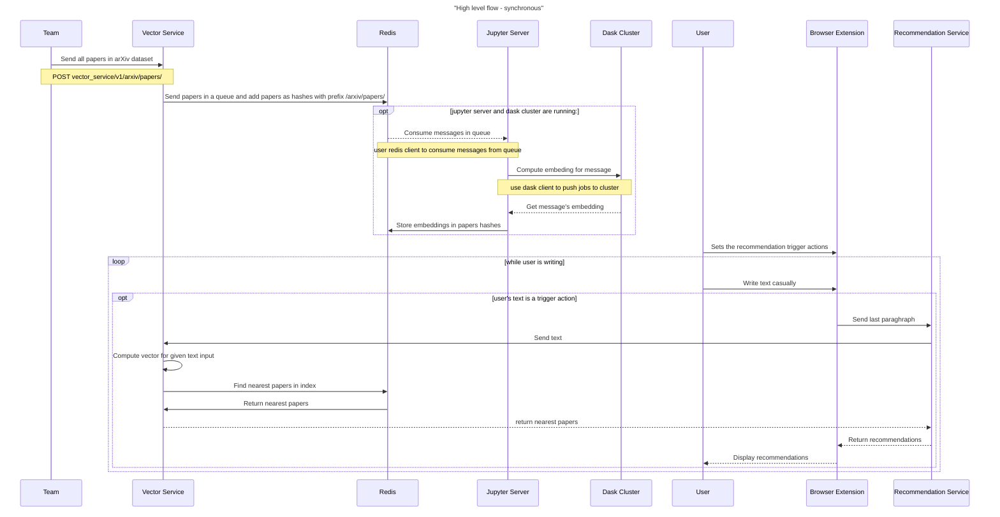

# redisventures-hackunamadata
https:/hackathon.redisventures.com/




# Components specification
## Redis
### Data structure
```json
{
    "id": "1801.00001",
    "title": "Title of the paper",
    "abstract": "Abstract of the paper",
    "categories": "cs.AI cs.CL cs.LG",
    "authors": "Author 1, Author 2, Author 3",
    "journal-ref": "Phys. Rev. B 76, 174425 (2007)"
}
```

## Vector Service
### Endpoints

| Endpoint | Method | Description | Request Body | Response Body |
| --- | --- | --- | --- | --- |
| /vector_service/v1/arxiv/papers | POST | Add the papers metadata in Redis hashes and put id in a Redis queue for future processing | `{"papers": [{"id": "123", "title": "title", "abstract": "abstract", ...}]}` | `{"status": "ok"}` |
| /vector_service/v1/arxiv/papers/{id} | GET | Get the metadata stored in Redis ahsh for the given arxiv paper id | - | `{"id": "123", "title": "title", "abstract": "abstract", ...}` |
| /vector_service/v1/text/nearest| POST | Get the nearest papers for the given text | `{"text": "string", "categories": ["cond-mat.dis-nn"], "years": ["2007", "2010"], "number_of_results": 5,"search_type": "KNN"}` | `{"papers": [{"id": "123", "title": "title", "abstract": "abstract"}, ...]}` |


## Recommendation Service
### Endpoints
| Endpoint | Method | Description | Request Body | Response Body |
| --- | --- | --- | --- | --- |
| /recommandation_service/v1/recommendations | POST | Get the recommendations for the given text and optional parameters | `{"text": "string", "categories": ["cond-mat.dis-nn"], "years": ["2007", "2010"], "number_of_results": 5}` | `{"papers": [{"id": "123", "title": "title", "abstract": "abstract"}]}` |

## Browser Extension
TBC